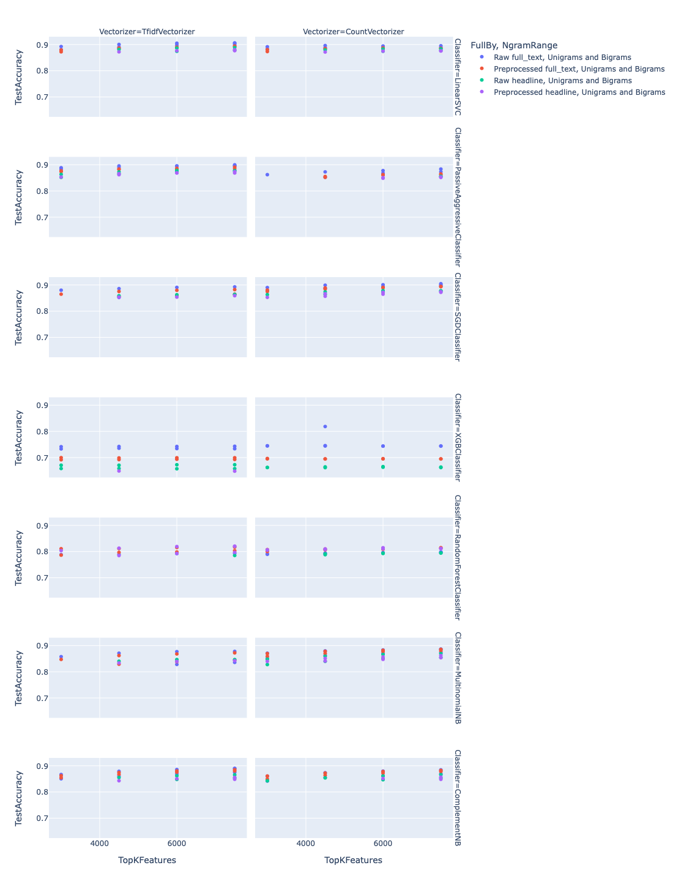

# NLP_SDLC_project
This is my project for the SDLC practice (5th semester) part at UCU

The main idea behind this project is about development of an efficent news classification model, able to label future streams of news with sufficient accuracy.
It is important to mention that the project is trying to resolve a multiclass classification problem.

## Data overview

### Data structure
The main dataset is retrieved in .json format from the following [source](https://www.kaggle.com/rmisra/news-category-dataset).
Data preprocessing was done majorly with *pandas* (although there were some manual fixes done to the structure of an initial file in order to properly parse the .json file),
dataset was presented as pandas.DataFrame.
Each data point (each row) of the dataset is represented by:
- **category** it belongs to, *category* column;
- **headline**, a sentence describing the main event of the news, *headline* column;
- **authors** who took part in writing the news, *authors* column;
- **link** to the original news source, *link* column;
- **short description** of the news, a text of 2 sentences on average, *short_description* column;
- **date** which the given news relates to, *date* column;

### News distribution
A total of 200853 news are in the dataset

#### Across categories
It is important to mention that there are 41 different news categories, moreover, as the below graphs shows, their distribution is far from equal, which might be a problem for some classifiers.

#### Across time
Unlike per-category news distribution, the distribution across time (more specifically, time period from 28th January, 2012 up to 26th May, 2018) seems to be a bit more linearly stable, despite the spike in the beginning and fall in the ending parts of the graph.

### The most common words per category
For this part, I have decided to use *wordcloud* visualisations for the three largest (by number of news) categories; 
each wordcloud contains up to 100 words, where the bigger words correspond to their higher frequency for news of specific category

**NOTE** Since across the entire dataset there are a lot of words which are used in literally any sentence, such as 'he', 'will', 'their', 'can', 'with' and many others, aka the ***stopwords***, they had to be removed in order to draw more significant insights about most common words for each of the categories

**Wordcloud for Politics news:**

  

**Wordcloud for Entertainment news:**

  

**Wordcloud for Wellness news:**

  

## Classifications with Machine Learning models

For this, I decided to first work with text data from only the top 5 most frequent news categories (since I could draw insight about models much quicker since models had to work with less data, as top 5 categories had only around 80k news articles, and then with data from all categories.
**Important:** below is the list of ML models I considered as for this project (all, except the `XGBClassifier` from `xgboost` library, come from `sklearn`)
* MultinomialNB 
* ComplementNB
* LinearSVC
* XGBClassifier
* PassiveAggressiveClassifier
* SGDClassifier
* RandomForestClassifier

### What classification was made on
Since the goal was to develop the most efficient model possible, I decided to track the performance of classification made 
both on *preprocessed* and *raw* data, and or any type of text data available, that is: 
* news article body from *short_description* column;
* news article headline from *headline* column;
* combined text data from *short_descrption* and *headline* from separate *full_text* column;

### Data preprocessing
Models, trained on preprocessed data, needed to have the text data processed in some way. 

First of all, it was important to remove words that are used in almost any sentence, such as 'the', 'a', 'and', 'is', etc.
The reason is simple, they carried much weight in each category, making some category-spesific words relatively invisible.
These are the so called ***stopwords***, and, hopefully, Python library named **nltk** provides a possibility for such operations
in the form of a specific set of stopwords. Each piece of text data in the columns specified above was transformed to lower-case and stopwords were removed from it.

Then, I made sure any numeric and non-alphanumeric symbols were removed too. Examples of such symbols are punctuation symbols, '$', '#' and others that might make the data noisy. 

### Vectorization
Machine learning models heavily rely on numerical data, or at least categorical. However, when in our case we have a total of thousands of unique words,
it makes sense to convert text data to some model-friendly format. This can be done with the technique called ***vectorization***, which is basically a numerical
representation of text.

For this project I mainly focused on 2 types of vectorizers, available in the *sklearn*:
* CountVectorizer
* TfidfVectorizer

**CountVectorizer** is the so called *bag-of-words* - that represents each word as the number of times it appears in the documents. CountVectorizer converts
collection of text documents to a matrix of token counts.

**TfidfVectorizer** - from **TF-IDF**, `Term Frequency x Inverse Document Frequency`, which multiplies the term frequency in specific document *d* by the inverse document frequency, the log of (number of documents/(number of documents that have a token *t* + 1)), in such a way discarding the importance of very frequent words - converts a collection of raw documents to a matrix of TF-IDF features.

**NOTE:** Since both vectorizers can be specified with what stopwords to use (parameter `stop_words`), I still decided to go with the `nltk`'s set, since it has more words.

Also, as for checking performance, I decided to let the vectorizers analyze different word combinations, by setting `ngram_range` parameter to specific tuple values:
* (1, 1) lets the vectorizer analyze singe words only, the so called *Unigrams*
* (1, 2) lets the vectorizer analysze both single words and word pairs, *Unigrams* and *Bigrams*
* (2, 2) lets the vectorizer analyze word pair only, the *Bigrams*

### Feature selection

Matrices, obtained by words and word phrases getting transformed by vectorizers, are then fed to selector (*SelectKBest* instance, which is initialized with the scoring function that assigns values to features, in my case it is the *f_classif*, based on ANOVA F-value) in order to filter
features, leaving only the top *k* for the trainining. That number, *k*, is also the parameter I tuned, checking models performance trained at 6k to 14k *TopKFeatures* selected.

### Metrics

The only metric I relied on when training models is the accuracy, the fraction of correctly classified news articles.

### Performance

**NOTE:** the data was split into train/test at 80/20 ratio, with respect to the distribution of news articles of different categories.
That basically means that the exactly same portion of each news category, present in the original non-split dataset, was held both in train and test datasets.

Also, the performance data is stored in the *results_...* folders as .csv files.

#### Peaking accuracies per classifier type

Let's first check performance of models trained on data containing news from only top 5 most frequent categories

  

Now, performance of models trained on data with all categories

  

#### Closer look at how different parameter (such as Vectorizer type, number of features selected etc.) affected the accuracy

Below graphs represent also what type of data - whether preprocessed or not, whether *headline*, *short_description* or *full_text* fits each model better.
**NOTE:** each graph has only up to 50 data points (ordered by accuracy, descendingly) per each classifier (did not want the graphs to be too clustered).

Again, starting with top 5 categories classification:

  

Now, for all category classification (notice that the top right subplot representing TfidfVectorizer for MultinomialNB model is empty; it is because the model was not trained with full-size data, transformed by TfidfVectorizer

  

#### Insights

One of the biggest insights for me was to discover that with increasing the number of features selected per vectorizer, meaning more words and word phrases are considered, the accuracy will not necessarily rise. This also relates to preprocessing the data, meaning some models performed better on raw data.
However, for some models there is a strong preference towards specific type of vectorizer, as well as specific type of data to classify on.

### Tuned models performance

Since cross-validation should be used during hyperparameter tuning, and, considering I decided to stick to KFold CV, at each fold the vectorizers had to be reset. Also I tuned each of the models' parameters separately, but at a smaller portion of data, which again is the data with only top 5 categories. Below are the results, and in the folder *results_after_tuning* one can find a small .csv file containing both the classifier's parameters which maximized accuracy on smaller portion of data, and the accuracy calculated after testing a model, trained on full-sized data (again, ratio train/test is 80/20)

  

### Conclusions on the ML part

Again, each model should be treated differently, with data preprocessed (or not) in specific way, having a specific vectorizer fit etc. The assumption of 'the more, the better' in terms of features selected does not hold in my case, first of all, visually; further in-depth research in the ML part could be done. Still, I received a peaking 58.5% accuracy on LinearSVC, which is quite a satisfying result to me, given that the number of classes, news categories, is 41.
